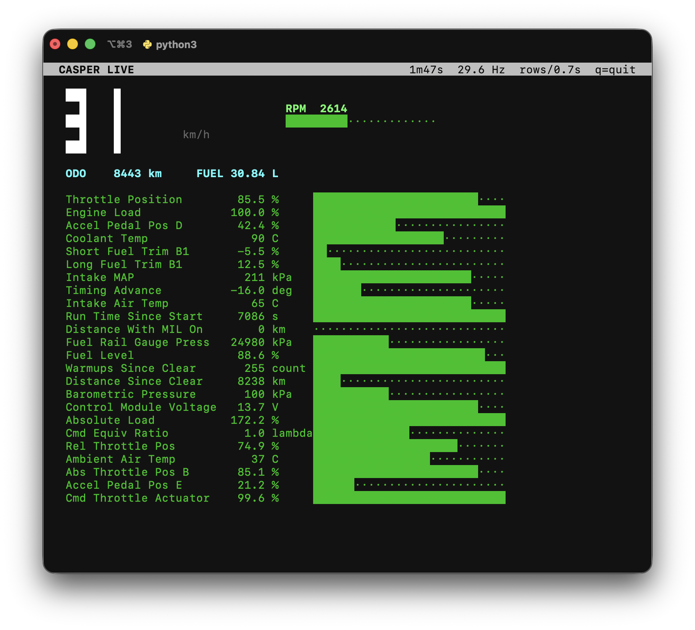
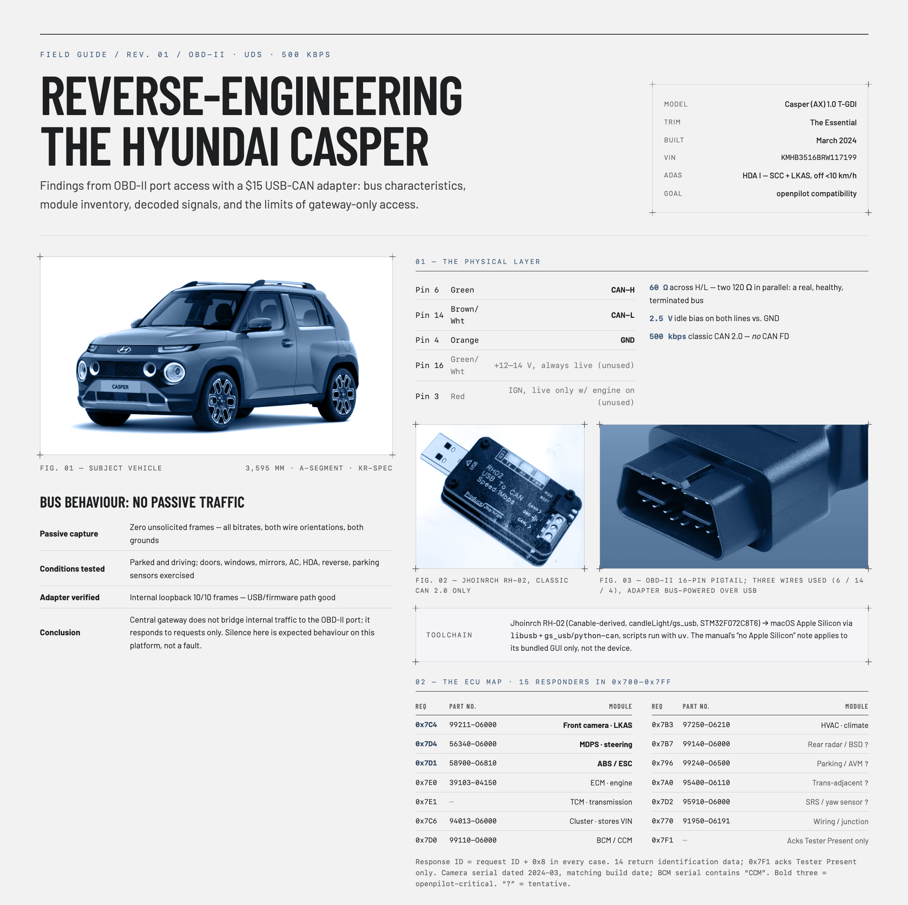
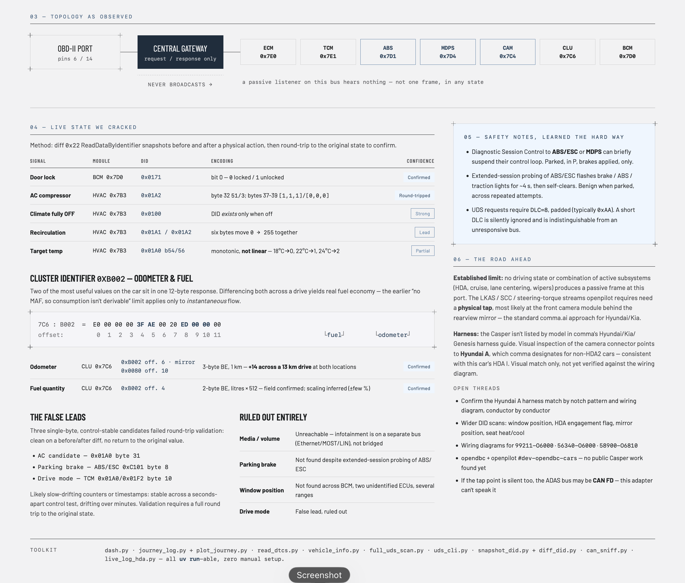

# Hyundai Casper (AX) — CAN Bus Technical Reference

Diagnostic network documentation for the Hyundai Casper (AX), covering the
physical interface, network architecture, module inventory, decoded signals and
fault-code coverage accessible through the SAE J1962 diagnostic connector.

Compiled toward assessing comma.ai / openpilot compatibility.



<sub>`dash.py` polling the vehicle at speed. Every value shown is **actively
polled** — this bus broadcasts nothing at all — yet the display sustains
**29.6 Hz** with a full rotation through the 21 slow-changing values every 0.7 s.
`ODO` and `FUEL` are read from the instrument cluster rather than derived; see
[04 §4](docs/04-signal-reference.md).</sub>

> **This is independent reverse-engineering work, not manufacturer
> documentation.** Every claim states its verification basis and confidence
> rating. Nothing here is endorsed by or sourced from Hyundai Motor Company.

---

## Applicability

| Field | Value |
|---|---|
| Model | Hyundai Casper (AX), 1.0 T-GDi, "The Essential" |
| Build date | 2024-03 |
| VIN | `KMHB3516BRW117199` |
| ADAS | HDA I — Smart Cruise Control + Lane Keeping Assist; disengages below 10 km/h |
| Diagnostic bit rate | 500 kbit/s, classic CAN 2.0, 11-bit identifiers |

Findings are from a single vehicle. Trim, market and model-year variation is
expected, particularly in module presence and identifier layout.

---

## Document set

| # | Document | Contents |
|---|---|---|
| **00** | [Safety and Operating Precautions](docs/00-safety.md) | **Normative. Read before connecting equipment.** |
| 01 | [Physical Interface](docs/01-physical-interface.md) | Connector pinout, bus electrical characteristics, adapter and host software |
| 02 | [Network Architecture](docs/02-network-architecture.md) | Gateway behaviour, addressing, transport, unreachable networks |
| 03 | [ECU Inventory](docs/03-ecu-inventory.md) | Vehicle identification, 15-address map, build record |
| 04 | [Signal Reference](docs/04-signal-reference.md) | Every located signal with encoding and confidence rating |
| 05 | [Diagnostics](docs/05-diagnostics.md) | Three-layer fault-code coverage and recorded vehicle state |
| 06 | [ADAS and openpilot](docs/06-adas-openpilot.md) | What the objective requires, what is established, what remains |
| 07 | [Methodology](docs/07-methodology.md) | Prescriptive signal-discovery technique and its failure modes |
| 08 | [Tool Reference](scripts/README.md) | Every tool in this repository |
| A | [Engineering Log](docs/appendix-a-engineering-log.md) | Chronological record, retained for provenance |

---

## Field guide

A two-page visual summary of the whole document set — bus characteristics,
module inventory, decoded signals, safety notes and open threads. Source text in
[`infographic.md`](infographic.md).



<sub>**Page 1** — subject vehicle and toolchain, verified J1962 pin assignment and
bus electricals, the no-passive-traffic finding with the conditions it was tested
under, and the 15-responder ECU map. Bold addresses are the three that matter for
openpilot; `?` marks identification inferred from part-number prefix alone.</sub>



<sub>**Page 2** — observed topology, the decoded live-state signals with
confidence ratings, the `0xB002` cluster identifier carrying both odometer and
fuel, the three false leads that failed round-trip validation, and the road
ahead including the Hyundai A harness assessment.</sub>

---

## Key architectural finding

**The segment exposed at the diagnostic connector carries no periodic broadcast
traffic.** It responds only to explicitly addressed requests. This is
characteristic of Hyundai/Kia vehicles from approximately 2018 onward and has
been confirmed under every tested condition, stationary and in motion, across all
common bit rates.

Two consequences govern everything else in this document set:

1. **Silence at the diagnostic connector is normal, not a fault.** Data is
   obtained by asking, never by listening. Every value is actively polled.
2. **The periodic ADAS messages openpilot requires are not obtainable here at
   all.** The forward camera, MDPS and ABS/ESC modules are individually reachable
   for diagnostic request/response, but diagnostic reachability of a module is not
   access to its network. A physical tap on the ADAS segment is required. See
   [06](docs/06-adas-openpilot.md).

---

## Capability summary

| Capability | Status |
|---|---|
| Vehicle identification, VIN | ✅ Available |
| Full module inventory with part numbers, serials, software versions | ✅ Available — 15 addresses |
| Fault codes across all modules, with status flags | ✅ Available — three protocol layers |
| Emissions readiness monitors | ✅ Available |
| 26 standard Mode 01 live values, batched 6 per request | ✅ Available — ~34 Hz refresh |
| Odometer | ✅ Available — verified incrementing |
| Fuel quantity in litres, and economy over a drive | ✅ Available — scaling constant inferred |
| Door lock, AC compressor, climate-off state | ✅ Available |
| Recirculation, target temperature, AUTO intensity | 🟡 Candidate — not round-trip validated |
| Window position, parking brake, drive mode, HDA engagement | ⬜ Not located — bounded search |
| Instantaneous fuel flow, tyre pressures, media control, last-parked position | ❌ Not present — architectural |
| Periodic LKAS / SCC / steering-torque streams | ❌ Not present at this connector |

Rating definitions: [04 §1](docs/04-signal-reference.md).

---

## Quick start

```
brew install libusb                      # macOS
uv run scripts/vehicle_info.py           # identification, odometer, build record
uv run scripts/read_dtcs.py              # fault codes, all layers
uv run scripts/dash.py                   # live dashboard
uv run scripts/journey_log.py            # record a drive; Ctrl-C to finish
uv run scripts/plot_journey.py           # plot the newest recording
```

Requires **Python 3.14+** and [`uv`](https://github.com/astral-sh/uv);
dependencies are declared inline per script (PEP 723), so there is no virtual
environment to manage. Full specification at
[01 §5](docs/01-physical-interface.md); every tool documented at
[08](scripts/README.md).

Two operational constraints apply immediately:

- **Only one process may hold the USB adapter at a time.** A second observes a
  silent bus and reports "no PIDs supported" — indistinguishable from the
  ignition being off.
- **Every tool is read-only except `full_uds_scan.py`**, which sends
  DiagnosticSessionControl and is stationary-use only.

---

## Repository layout

```
docs/               numbered technical documents (00-07, appendix A)
scripts/            tools; see scripts/README.md (document 08)
scripts/archive/    superseded session-1 tools, retained for provenance
references/         connector and adapter reference photographs
images/             screenshots used in the documentation
journeys/           recorded drive logs (JSONL + CSV + summary) — local only
*.json              captured reference data — vehicle_info, dtc_report,
                    before_drive / after_drive snapshots
```
