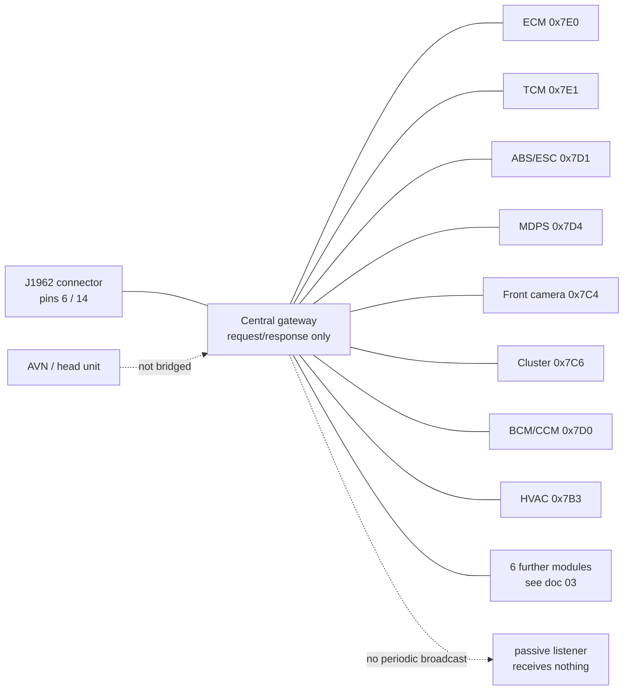

# 02 — Network Architecture

The behaviour of the vehicle's central gateway as seen from the diagnostic
connector, and the consequences for what data is and is not obtainable there.

---

## 1. Gateway behaviour: strictly request/response

**The segment exposed at the diagnostic connector (J1962 pins 6/14) carries no
periodic broadcast traffic. It responds only to explicitly addressed requests.**

This is the single most important architectural fact about this vehicle. It is
characteristic of Hyundai/Kia vehicles from approximately 2018 onward, where the
central gateway isolates internal vehicle networks from the diagnostic port and
relays only diagnostic request/response transactions.

### 1.1 Evidence

| Test | Conditions | Result |
|---|---|---|
| Passive listen | All common bit rates (500k / 250k / 125k / 100k / 50k / 20k / 1M), both wire orientations, both ground options, normal and listen-only controller modes | **0 frames** |
| Passive listen, stationary | Doors locked/unlocked, windows, hazards, reverse gear, parking-sensor proximity alarm, mirror adjustment, HVAC on/off | **0 frames** |
| Passive listen, in motion | 180 s drive; HDA engaged three times (~3 s each, 27–28 km/h), lane centering enabled twice, wipers, washer | **0 unsolicited frames** out of the full log |
| Passive listen, in motion | 120 s drive, 528 logged rows | **528/528** were responses to the tool's own requests; 0 unsolicited |
| Adapter loopback | `GS_CAN_MODE_LOOP_BACK` | **10/10** frames echoed — USB, firmware and controller receive path healthy |
| Active request | Mode 01 PID 00 to `0x7DF` | **Immediate responses** from `0x7E8` and `0x7E9` |

The loopback and active-request results together establish that the wiring, pin
identification, adapter and host software were correct throughout. Silence was a
property of the vehicle, not a fault in the equipment.

> **Operational consequence:** on this vehicle, an idle bus at the diagnostic
> port means *ask, do not listen*. No amount of driving and no combination of
> active subsystems will produce passive traffic on this segment.

### 1.2 Topology

## 2. Addressing and transport

### 2.1 Physical addressing

Diagnostic addressing follows the convention **response ID = request ID + `0x8`**
without exception across every module discovered on this vehicle.

Modules are **not** confined to the OBD-standard `0x7E0`–`0x7E7` range. A scan
restricted to that range finds 2 modules; a scan of the full `0x700`–`0x7FF`
range finds 14. See [03 — ECU Inventory](03-ecu-inventory.md).

### 2.2 Frame padding is mandatory

**All request frames must be padded to DLC = 8** (ISO 15765-4 padding,
conventionally with `0xAA`), regardless of actual payload length.

This vehicle's ECUs **silently discard** short-DLC frames. A request sent with
`DLC=3` produces no response and no error — a failure mode indistinguishable
from a sleeping gateway. This is a hard requirement, not an optimisation.

### 2.3 Multi-frame transport

Payloads exceeding 7 bytes use ISO-TP (ISO 15765-2). A First Frame must be
answered with a Flow Control frame to receive the remaining Consecutive Frames.
Responses requiring this path include:

- Mode 09 PID 02 (VIN) and PID 0A (ECU name)
- Most `0x22` ReadDataByIdentifier responses
- Multi-PID Mode 01 responses (see [04 §5](04-signal-reference.md))
- UDS `0x19 0x02` DTC reports

### 2.4 Read timeouts must be non-zero

`libusb` interprets a receive timeout of `0` as **block indefinitely**, not as
non-blocking. Because this bus never broadcasts, a zero-timeout read on an idle
bus never returns. All frame reads must specify a small but non-zero timeout.

## 3. Networks not reachable from the diagnostic connector

| Network / function | Status | Basis |
|---|---|---|
| **ADAS periodic broadcast** (LKAS command, SCC status, steering torque, camera output at ~50–100 Hz) | Not reachable | Not present as broadcast traffic on this segment under any tested condition. Diagnostic reachability of the camera and MDPS modules does not imply access to their periodic messaging. |
| **AVN / infotainment head unit** (audio, volume, navigation, last-parked position) | Not reachable | Exhaustively searched across all 14 discovered modules with no correlate. Modern AVN systems typically sit on Ethernet, MOST, or a dedicated segment not bridged to the diagnostic gateway. **Hard negative.** |
| **TPMS per-wheel pressures** | Not present | No TPMS module answers anywhere in `0x700`–`0x7FF`. Consistent with indirect (ABS-derived) TPMS on this trim, which computes from wheel speeds and holds no pressure value. |

Access to any of the above requires a physical tap on the relevant segment. See
[06 — ADAS and openpilot](06-adas-openpilot.md).
