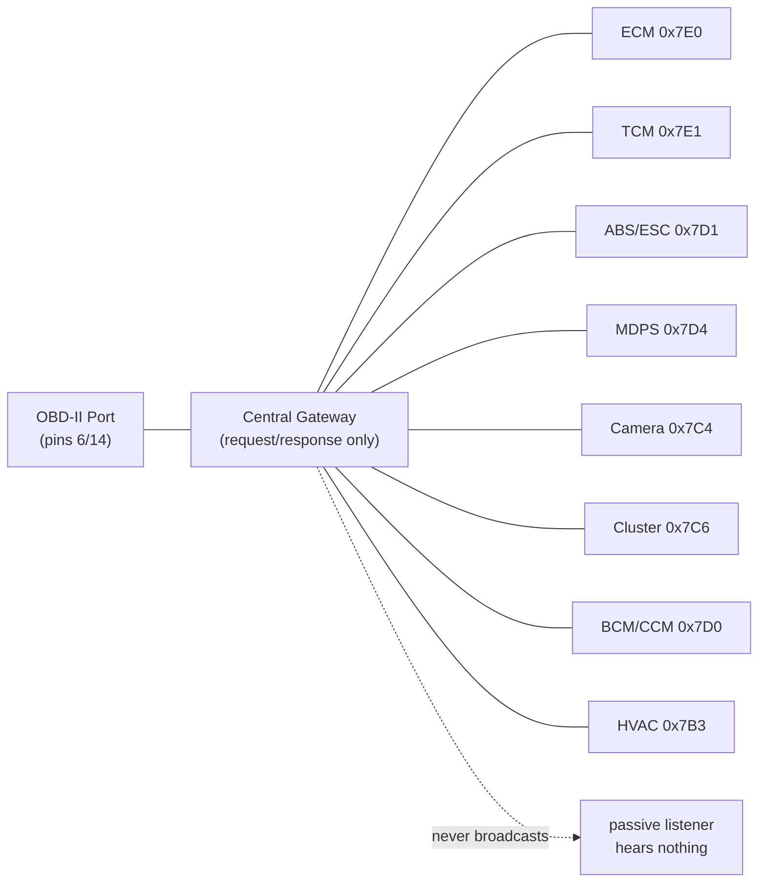

# Reverse-Engineering the Hyundai Casper CAN Bus

*A field guide to what we know so far — one OBD-II port, one $15 USB-CAN adapter, and a lot of stubborn diffing.*

---

## The Car

| | |
|---|---|
| **Model** | Hyundai Casper (AX), 1.0 Turbo "The Essential" |
| **Built** | March 2024 |
| **VIN** | `KMHB3516BRW117199` |
| **ADAS** | HDA I (Highway Driving Assist) — smart cruise control + lane keep, disengages below 10 km/h |
| **Goal** | comma.ai / openpilot compatibility |

---

## The Physical Layer

```
OBD-II Pin 6  ──  Green         ──  CAN-H
OBD-II Pin 14 ──  Brown/White   ──  CAN-L
OBD-II Pin 4  ──  Orange        ──  GND
OBD-II Pin 16 ──  Green/White   ──  Battery+ (constant, ~12-14V)
OBD-II Pin 3  ──  Red           ──  Switched ignition power (unused)
```

- **Termination:** 60Ω across CAN-H/CAN-L (two 120Ω resistors in parallel — a real, healthy, terminated bus)
- **Idle bias:** ~2.5V on both CAN-H and CAN-L relative to GND
- **Adapter:** Jhoinrch RH-02 (Canable-derived, candleLight/gs_usb firmware, STM32F072C8T6, classic CAN 2.0 only — no CAN FD)
- **Bitrate:** 500 kbps
- **Software:** macOS (Apple Silicon) via `libusb` + `gs_usb`/`python-can`, `uv` for zero-install script execution — despite the adapter's manual claiming no Apple Silicon support (that only applies to its bundled GUI)

---

## Plot Twist #1: The Bus Is Silent

Passive listening — every bitrate, both wire orientations, both GND options, parked *and* mid-drive with doors/windows/mirrors/AC/HDA/reverse/parking-sensors all exercised — produced **zero unsolicited frames**, ever.

This looked like a dead adapter. It wasn't. The USB/firmware pipeline passed an internal loopback test (10/10 frames echoed) — the hardware was fine. **The car's central gateway simply never broadcasts internal traffic to the OBD-II port.** It only answers when spoken to.

> Lesson: on a modern Hyundai/Kia, silence at the OBD port means "ask, don't listen" — not "broken."

---

## The ECU Map

Full scan of `0x700`-`0x7FF` with UDS Tester Present found **14 responding modules** (response ID = request ID + `0x8` in every case):

| Request ID | Part Number | Module |
|---|---|---|
| `0x7E0` | `39103-04150` | **ECM** (Engine Control) |
| `0x7E1` | — | **TCM** (Transmission Control) |
| `0x7D1` | `58900-O6810` | **ABS/ESC** |
| `0x7D4` | `56340-O6000` | **MDPS** (steering) |
| `0x7C4` | `99211-O6000` | **Front camera** (LKAS) — serial dated 2024-03, matches build date |
| `0x7C6` | `94013-O6000` | Cluster (CLU) — also stores VIN |
| `0x7D0` | `99110-O6000` | BCM/CCM (serial literally contains `"CCM"`) |
| `0x7B3` | `97250-O6210` | HVAC / climate |
| `0x7B7` | `99140-O6000` | Rear radar / BSD (tentative) |
| `0x796` | `99240-O6500` | Parking sensors / around-view (tentative) |
| `0x7A0` | `95400-O6110` | Transmission-adjacent (tentative) |
| `0x7D2` | `95910-O6000` | Unclear — SRS/yaw sensor? |
| `0x770` | `91950-O6191` | Wiring/junction-related |
| `0x7F1` | — | Acks Tester Present only |

**The big three for openpilot**: camera (`0x7C4`), MDPS (`0x7D4`), ABS/ESC (`0x7D1`) — all identified by part number, ready to look up wiring diagrams.



---

## Live State: What We Cracked

Found by diffing `0x22` (ReadDataByIdentifier) snapshots before/after a physical action — same trick a commercial scan tool uses, just done by hand.

| Signal | Module | DID | Encoding | Confidence |
|---|---|---|---|---|
| **Door lock** | BCM `0x7D0` | `0x0171` | bit 0: `0`=locked, `1`=unlocked | ✅ Confirmed, clean |
| **AC compressor** | HVAC `0x7B3` | `0x01A2` | byte32 `51`/`3`, bytes37-39 `[1,1,1]`/`[0,0,0]` | ✅ Confirmed, round-trip validated |
| **Climate fully OFF** | HVAC `0x7B3` | `0x0100` | DID *exists* only when off | ✅ Strong, one caveat |
| **Recirculation** | HVAC `0x7B3` | `0x01A1`/`0x01A2` | six bytes `0`→`255` together | 🟡 Strong lead, not fully round-tripped |
| **Target temp** | HVAC `0x7B3` | `0x01A0` bytes 54/56 | monotonic, **not linear** (18°C→0, 22°C→1, 24°C→2) | 🟡 Partial — needs a lookup table |

## The False Leads (and why they matter)

Three different "clean, single-byte, control-stable" signals all **failed round-trip validation** — they looked perfect on a quick before/after diff, then didn't flip back:

- AC candidate (`0x01A0` byte 31)
- Parking brake candidate (ABS/ESC `0xC101` byte 8)
- Drive mode candidate (TCM `0x01A0`/`0x01F2` byte 10)

**The pattern**: these are likely slow-drifting counters/timestamps that pass a quick control test (seconds apart) but drift over longer timescales (minutes) — exactly the timescale of a real round-trip test.

> **Methodology upgrade**: a short control snapshot isn't proof. Always round-trip back to the original state before trusting a diff.

## Ruled Out Entirely

| | Verdict |
|---|---|
| **Media/volume** | Confirmed unreachable — infotainment is almost certainly on a separate bus (Ethernet/MOST/LIN), not bridged to this gateway |
| **Parking brake** | Not found despite extended-session probing of ABS/ESC (safe when parked — briefly flashes brake/ABS/traction lights, always self-clears) |
| **Window position** | Not found across BCM, two unidentified ECUs, several ranges |
| **Drive mode** | False lead, ruled out |

---

## Safety Notes (learned the hard way)

- Sending Diagnostic Session Control to **ABS/ESC** or **MDPS** while driving is a genuine hazard — can briefly suspend their control loop. **Parked, in P, brakes applied, only.**
- On this car, extended-session probing of ABS/ESC reliably flashes brake/ABS/traction-control warning lights for ~4 seconds, then self-clears. Consistently benign parked — confirmed across many repeated attempts.
- Frame padding matters: OBD-II/UDS requests need **DLC=8** (padded, typically with `0xAA`) even for short payloads — a short DLC gets silently ignored, which looks exactly like "the car is asleep."

---

## The Road Ahead

**Proven, hard limit**: no amount of driving, no combination of subsystems active (we tried HDA, cruise, lane centering, wipers, everything) produces a single passive frame on this bus. Getting the actual **LKAS/SCC/steering-torque data streams** that openpilot needs requires a **physical tap** — most likely at the front camera module behind the rearview mirror, per the standard comma.ai/openpilot approach for Hyundai/Kia.

**Open threads:**
- Wider DID scans for window position, HDA engagement flag, mirror position, seat heating/cooling
- Look up wiring diagrams for `99211-O6000` (camera) / `56340-O6000` (MDPS) / `58900-O6810` (ABS/ESC)
- Check `opendbc` + openpilot Discord `#dev-opendbc-cars` — no public Casper reverse-engineering found yet
- If the physical tap point is also silent: the ADAS bus may be **CAN FD**, not classic CAN — current adapter can't speak that

---

*Toolkit: `scripts/can_sniff.py`, `scripts/obd_isotp.py`, `scripts/full_uds_scan.py`, `scripts/snapshot_did.py` + `diff_did.py`, `scripts/live_log.py`, `scripts/live_log_hda.py`, `scripts/uds_cli.py` — all `uv run`-able, zero manual setup.*
