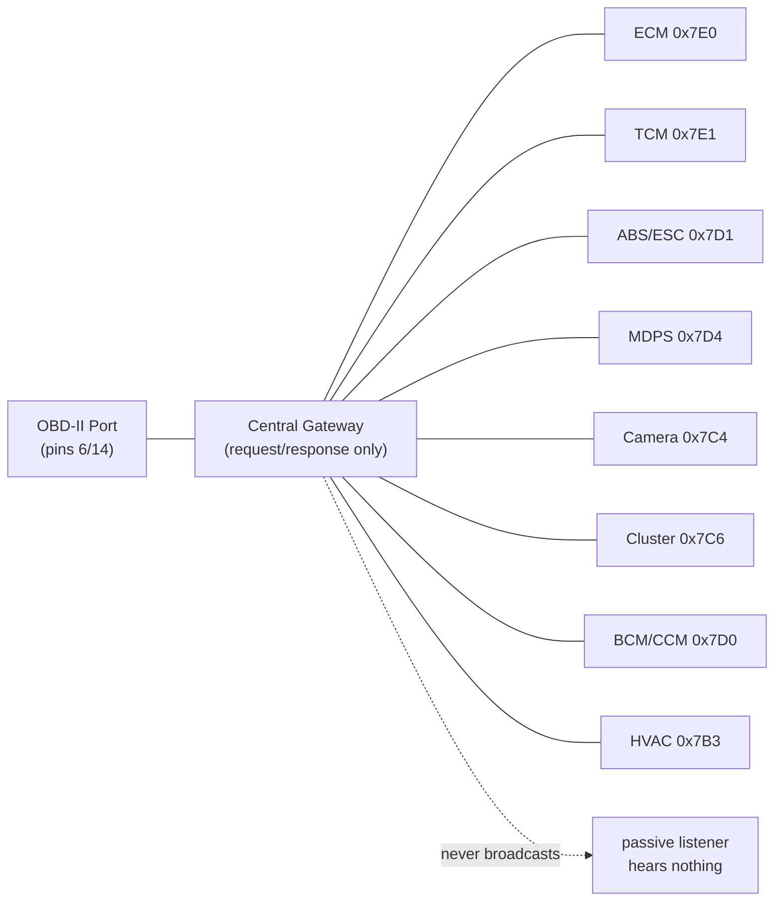

# Reverse-Engineering the Hyundai Casper CAN Bus

*A field guide to what we know so far — one OBD-II port, one $15 USB-CAN adapter, and a lot of stubborn diffing.*

> Condensed summary. The authoritative reference is the numbered document set —
> start at [`README.md`](README.md).

---

## The Car

| | |
|---|---|
| **Model** | Hyundai Casper (AX), 1.0 Turbo "The Essential" |
| **Built** | March 2024 |
| **VIN** | `KMHB3516BRW117199` |
| **ADAS** | HDA I (Highway Driving Assist) — smart cruise control + lane keep, disengages below 10 km/h |
| **Goal** | comma.ai / openpilot compatibility |

---

## The Physical Layer

```
OBD-II Pin 6  ──  Green         ──  CAN-H
OBD-II Pin 14 ──  Brown/White   ──  CAN-L
OBD-II Pin 4  ──  Orange        ──  GND
OBD-II Pin 16 ──  Green/White   ──  Battery+ (constant, ~12-14V)
OBD-II Pin 3  ──  Red           ──  Switched ignition power (unused)
```

- **Termination:** 60Ω across CAN-H/CAN-L (two 120Ω resistors in parallel — a real, healthy, terminated bus)
- **Idle bias:** ~2.5V on both CAN-H and CAN-L relative to GND
- **Adapter:** Jhoinrch RH-02 (Canable-derived, candleLight/gs_usb firmware, STM32F072C8T6, classic CAN 2.0 only — no CAN FD)
- **Bitrate:** 500 kbps
- **Software:** macOS (Apple Silicon) via `libusb` + `gs_usb`/`python-can`, `uv` for zero-install script execution — despite the adapter's manual claiming no Apple Silicon support (that only applies to its bundled GUI)

---

## Plot Twist #1: The Bus Is Silent

Passive listening — every bitrate, both wire orientations, both GND options, parked *and* mid-drive with doors/windows/mirrors/AC/HDA/reverse/parking-sensors all exercised — produced **zero unsolicited frames**, ever.

This looked like a dead adapter. It wasn't. The USB/firmware pipeline passed an internal loopback test (10/10 frames echoed) — the hardware was fine. **The car's central gateway simply never broadcasts internal traffic to the OBD-II port.** It only answers when spoken to.

> Lesson: on a modern Hyundai/Kia, silence at the OBD port means "ask, don't listen" — not "broken."

---

## The ECU Map

Full scan of `0x700`-`0x7FF` with UDS Tester Present found **15 responding addresses** — 14 that return identification data, plus `0x7F1` which acks TesterPresent and nothing else (response ID = request ID + `0x8` in every case):

| Request ID | Part Number | Module |
|---|---|---|
| `0x7E0` | `39103-04150` | **ECM** (Engine Control) |
| `0x7E1` | — | **TCM** (Transmission Control) |
| `0x7D1` | `58900-O6810` | **ABS/ESC** |
| `0x7D4` | `56340-O6000` | **MDPS** (steering) |
| `0x7C4` | `99211-O6000` | **Front camera** (LKAS) — serial dated 2024-03, matches build date |
| `0x7C6` | `94013-O6000` | Cluster (CLU) — also stores VIN |
| `0x7D0` | `99110-O6000` | BCM/CCM (serial literally contains `"CCM"`) |
| `0x7B3` | `97250-O6210` | HVAC / climate |
| `0x7B7` | `99140-O6000` | Rear radar / BSD (tentative) |
| `0x796` | `99240-O6500` | Parking sensors / around-view (tentative) |
| `0x7A0` | `95400-O6110` | Transmission-adjacent (tentative) |
| `0x7D2` | `95910-O6000` | Unclear — SRS/yaw sensor? |
| `0x770` | `91950-O6191` | Wiring/junction-related |
| `0x7F1` | — | Acks Tester Present only |

**The big three for openpilot**: camera (`0x7C4`), MDPS (`0x7D4`), ABS/ESC (`0x7D1`) — all identified by part number, ready to look up wiring diagrams.



---

## Live State: What We Cracked

Found by diffing `0x22` (ReadDataByIdentifier) snapshots before/after a physical action — same trick a commercial scan tool uses, just done by hand.

| Signal | Module | DID | Encoding | Confidence |
|---|---|---|---|---|
| **AC compressor** | HVAC `0x7B3` | `0x01A2` | byte32 `51`/`3`, bytes37-39 `[1,1,1]`/`[0,0,0]` | ✅ Confirmed — round-tripped, ~1000 samples, zero jitter |
| ~~**Door lock**~~ | BCM `0x7D0` | `0x0171` | ~~bit 0~~ | ❌ **Refuted** — see below |
| ~~**Climate fully OFF**~~ | HVAC `0x7B3` | `0x0100` | ~~DID exists only when off~~ | ❌ **Refuted** — answered ~450/450 probes in every state |
| **Recirculation** | HVAC `0x7B3` | `0x01A1`/`0x01A2` | six bytes `0`→`255` together | 🟡 Strong lead, not fully round-tripped |
| **Target temp** | HVAC `0x7B3` | `0x01A0` bytes 54/56 | monotonic, **not linear** (18°C→0, 22°C→1, 24°C→2) | 🟡 Partial — needs a lookup table |

### Two "Confirmed" signals that weren't

Re-checking those entries by **sampling a few hundred reads per state** instead of one retired two of them.

Door lock was recorded as `134` locked / `135` unlocked. Across ~730 samples in each state, with the doors untouched:

| Byte | Locked | Unlocked |
|---|---|---|
| `132` | 14 | 55 |
| `133` | 239 | 235 |
| `134` | **395** | **429** |
| `135` | 80 | 6 |

Both states produce all four values, and the documented *locked* value is the commonest reading in **both**. The low bits jitter; the original diff caught 134 and 135 by luck. Climate-off went the same way — the DID it relied on answered every one of ~450 probes in every state.

A single read cannot tell a state bit from a jittering one. The A/C byte passed the same test cleanly — one value per state, zero jitter — so this isn't an impossible bar, and A/C is the one body signal on the live dashboard.

And the two most useful numbers on the car, both in one cluster identifier:

```
7C6 : B002  =  E0 00 00 00 3F AE 00 20 ED 00 00 00
offset:        0  1  2  3  4  5  6  7  8  9 10 11
                           └fuel┘  └─odometer──┘
```

| Signal | Module | DID | Encoding | Confidence |
|---|---|---|---|---|
| **Odometer** | Cluster `0x7C6` | `0xB002` off. 6 (mirror: `0x0080` off. 10) | 3-byte BE, 1 km | ✅ Confirmed — **+14 across a 13 km drive** at both locations |
| **Fuel quantity** | Cluster `0x7C6` | `0xB002` off. 4 | 2-byte BE, litres × 512 | ✅ Field confirmed; ×512 scaling inferred (±few %) |

Differencing both across a drive gives real fuel economy — which is why the earlier "no MAF, so consumption isn't derivable" claim was only true of *instantaneous* flow.

## Steering: One DID, Two Signals, Nearly One Mistake

```
7D4 : 0101  =  7A 79 FF 92 FF 92 00 FF C3 00 00 03 03 01 2C 01
offset:        0  1  2  3  4  5  6  7  8  9 10 11 12 13 14 15
                     └torque┘ └─angle─┘
```

| Signal | Module | DID | Encoding | Confidence |
|---|---|---|---|---|
| **Steering angle** | MDPS `0x7D4` | `0x0101` off. 4 | 2-byte signed BE, 0.1°/count, **+ = left** | ✅ Confirmed — ±457° = 2.5 turns lock-to-lock, exactly the car's spec |
| **Steering torque** | MDPS `0x7D4` | `0x0101` off. 2 | 2-byte signed BE, full scale **±10000**, **+ = right** | ⚠️ Field + full scale confirmed; no Nm calibration exists |

Torque **clamps at exactly ±10000** — 186/186 samples pegged pushing hard at the left lock, 201/201 at the right. An exact, symmetric, round limit in both directions is firmware, not a sensor running out of range, so that's a real full scale. It still doesn't give us Nm: ±10.00 Nm at 0.001/count is a plausible steering range, and plausible is not evidence.

Note the **sign conventions disagree** — positive angle is leftward, positive torque is rightward. Measured twice each way; that's really how it is.

These were rated *Not located* after a 180-second logged drive, then fell out of a **4-second stationary capture**. A drive moves speed, angle, torque and load all at once, so nothing stands out; turning lock-to-lock in a parked car sweeps one control through its entire range with everything else frozen.

The near-miss: torque tracked angle perfectly across left, centre and right, and was nearly filed as a redundant inverted angle channel. It had to track — *holding the wheel against a lock loads both at once*. Pushing the wheel without letting it turn swung torque to ±700 at a constant 0.1°, and that settled it. When two fields correlate across every test you've run, that's a fact about your tests.

## The False Leads (and why they matter)

Three different "clean, single-byte, control-stable" signals all **failed round-trip validation** — they looked perfect on a quick before/after diff, then didn't flip back:

- AC candidate (`0x01A0` byte 31)
- Parking brake candidate (ABS/ESC `0xC101` byte 8)
- Drive mode candidate (TCM `0x01A0`/`0x01F2` byte 10)

**The pattern**: these are likely slow-drifting counters/timestamps that pass a quick control test (seconds apart) but drift over longer timescales (minutes) — exactly the timescale of a real round-trip test.

> **Methodology upgrade**: a short control snapshot isn't proof. Always round-trip back to the original state before trusting a diff.

## Ruled Out Entirely

| | Verdict |
|---|---|
| **Media/volume** | Confirmed unreachable — infotainment is almost certainly on a separate bus (Ethernet/MOST/LIN), not bridged to this gateway |
| **Parking brake** | Not found despite extended-session probing of ABS/ESC (safe when parked — briefly flashes brake/ABS/traction lights, always self-clears) |
| **Window position** | Not found across BCM, two unidentified ECUs, several ranges |
| **Drive mode** | False lead, ruled out |

---

## Safety Notes (learned the hard way)

- Sending Diagnostic Session Control to **ABS/ESC** or **MDPS** while driving is a genuine hazard — can briefly suspend their control loop. **Parked, in P, brakes applied, only.**
- On this car, extended-session probing of ABS/ESC reliably flashes brake/ABS/traction-control warning lights for ~4 seconds, then self-clears. Consistently benign parked — confirmed across many repeated attempts.
- Frame padding matters: OBD-II/UDS requests need **DLC=8** (padded, typically with `0xAA`) even for short payloads — a short DLC gets silently ignored, which looks exactly like "the car is asleep."

---

## The Road Ahead

**Proven, hard limit**: no amount of driving, no combination of subsystems active (we tried HDA, cruise, lane centering, wipers, everything) produces a single passive frame on this bus. Getting the actual **LKAS/SCC/steering-torque data streams** that openpilot needs requires a **physical tap** — most likely at the front camera module behind the rearview mirror, per the standard comma.ai/openpilot approach for Hyundai/Kia.

**Harness:** the Casper isn't listed by model in comma's Hyundai/Kia/Genesis harness guide, but visual inspection of the camera connector points to **Hyundai A** — which comma designates for *non-HDA2* cars, consistent with this car's HDA I. Visual match only; not yet verified against the wiring diagram.

**Open threads:**
- Confirm the Hyundai A match by notch pattern and wiring diagram, conductor by conductor
- Wider DID scans for window position, HDA engagement flag, mirror position, seat heating/cooling
- Look up wiring diagrams for `99211-O6000` (camera) / `56340-O6000` (MDPS) / `58900-O6810` (ABS/ESC)
- Check `opendbc` + openpilot Discord `#dev-opendbc-cars` — no public Casper reverse-engineering found yet
- If the physical tap point is also silent: the ADAS bus may be **CAN FD**, not classic CAN — current adapter can't speak that

---

*Toolkit: `dash.py` (live dashboard), `journey_log.py` + `plot_journey.py` (record & plot a drive), `read_dtcs.py` (fault codes), `vehicle_info.py` (odometer, build record, signal search), plus the reverse-engineering instruments `full_uds_scan.py`, `uds_cli.py`, `snapshot_did.py` + `diff_did.py`, `can_sniff.py`, `live_log_hda.py` — all `uv run`-able, zero manual setup. Full reference: [`experimentation/README.md`](experimentation/README.md).*
